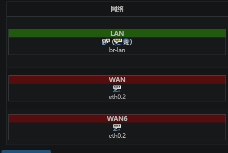

# 项目介绍

Gzhu的宿舍网络和空调问题广受诟病，空调我们无能为力。  
但是我觉得30块钱100兆网络放在现在25年有点......  
所以本次教程是GZHU校园网的几种使用方式，包括最简单的方法和高阶方法。

---

# 设备单

- **基础多人使用**：随便一个路由器（一个账号）
- **基础网络链路聚合**：带双WAN的路由器，或者刷了OpenWrt的路由器（由于这几年路由器厂商限制刷机，所以可以稍微老点的路由器，如斐讯K2，AC2100，AX6）（一个账号）
- **高阶网络链路聚合**：两个刷好OpenWrt的路由器（需要MAC替换）（多个账号）

---

# 风险须知

由于尚未抓过包，不清楚具体风险，但一般会触发MAC黑名单，更换一个MAC即可解除。

---

# 使用说明

## ✅ 基础多人使用

适用于一个宿舍共享一个校园网账号。  
操作非常简单：路由器插WAN口，正常在认证界面登录即可。

---

## ✅ 基础链路聚合

通过查看校园网的使用规则可以发现，一个账号允许**绑定两个MAC地址（两个设备）**。  
双WAN口的路由器自带两个MAC，一个设备可以虚拟出两个MAC，实现双拨。

### 步骤：

1. 正常插上第一条网线到WAN口，在登录界面选择绑定MAC，完成登录。  
2. 然后迅速**拔下第一条网线**，插入第二条WAN口，登录第二个MAC。  
3. 登录完成后，将第一条WAN网线再插回来即可。

- OpenWrt的配置类似，网上有很多详细的教程。

> 如果MAC上黑名单了，直接在路由器后台修改MAC地址即可。

---

## ✅ 高级链路聚合（不推荐）

⚠️ 说明：这个方法只能提升下行速度，上行带宽是共享的，不会变化。

### 条件：

- 宿舍的网口**不是物理限速的**。
- 两台刷了OpenWrt的路由器，分别作为**入户路由器**和**无线路由器**。

### 步骤：

1. 将入户路由器的网线插到LAN口，这样它就类似教学区的WiFi，连接WiFi后才能上网。  
2. 使用手机或电脑连接入户路由器的WiFi，分别登录并记录下两个绑定的MAC地址。  
3. 在无线路由器上，将多WAN口的MAC地址修改为上一步记录的两个MAC地址。  
4. 断开WiFi，将网线插入WAN口，完成双拨。

---

# 🔥 总结

- 普通多人使用：最简单，1个账号搞定。  
- 基础双拨：提升一点带宽，双WAN或者OpenWrt轻松搞定。  
- 高级多拨：投入高，收益低，不推荐。

